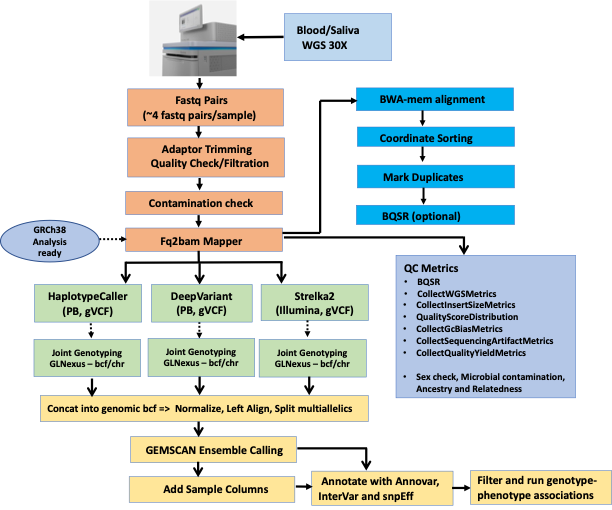

## GenCompass: Germline Ensemble Calling of Mutations with Parabricks Accelerated Software Suite

---

### AUTHORS

Ben Jordan and Laura Egolf

Technical Lead: Komal Jain

---

## Table of Contents

- [GenCompass Overview](#gencompass-overview)
  - [Premap-QC](#premap-qc)
    - [Fastp](#fastp)
    - [Fastq-Screen](#fastq-screen)
    - [FastQC](#fastqc)
  - [Mapping](#mapping)
    - [Parabricks fq2bam](#parabricks-fq2bam)
    - [Parabricks collectmultiplemetrics](#parabricks-collectmultiplemetrics)
    - [Parabricks bammetrics](#parabricks-bammetrics)
    - [VerifyBamId](#verifybamid)
    - [Samtools coverage](#samtools-coverage)
    - [Kraken](#kraken)
    - [Somalier](#somalier)
  - [Variant Calling](#variant-calling)
    - [Parabricks DeepVariant](#parabricks-deepvariant)
    - [Parabricks HaplotypeCaller](#parabricks-haplotypecaller)
    - [Strelka2](#strelka2)
  - [Joint Genotype](#joint-genotype)
    - [GLNexus](#glnexus)
  - [Harmonize](#harmonize)
- [Running GenCompass](#running-gencompass)
    - [Before using](#before-using)
    - [Example 1. Generating all workflow files](#example-1-generating-all-workflow-files)
    - [Example 2. Generate single workflow inputs](#example-2-generate-single-workflow-inputs)
  - [Input Files](#input-files)
    - [Manifest](#manifest)
    - [Sample List (optional)](#sample-list-optional)
    - [Fastq Files](#fastq-files)
    - [Project Parameters JSON](#project-parameters-json)
- [Dependencies](#dependencies)
- [Output Folder Structure](#output-folder-structure)
    - [Premap-QC Output Folder Structure](#premap-qc-output-folder-structure)
    - [Mapping Output Folder Structure](#mapping-output-folder-structure)
    - [Variant Calling Output Folder Structure](#variant-calling-output-folder-structure)
    - [Joint Genotype Output Folder Structure](#joint-genotype-output-folder-structure)
    - [Harmonize Output Folder Structure](#harmonize-output-folder-structure)

# GenCompass Overview

The GenCompass workflow is separated into five main modules: premapping and premapping-qc, mapping and postmap-qc, variant calling, joint genotyping, and harmonization


## Premap-QC

### Fastp
>
> A tool designed to provide fast all-in-one preprocessing for FastQ files. This tool is developed in C++ with multithreading supported to afford high performance.
>
> Shifu Chen, Yanqing Zhou, Yaru Chen, Jia Gu; fastp: an ultra-fast all-in-one FASTQ preprocessor, Bioinformatics, Volume 34, Issue 17, 1 September 2018, Pages i884–i890, <https://doi.org/10.1093/bioinformatics/bty560>
>
### Fastq-Screen
>
> FastQ Screen allows you to set up a standard set of libraries against which all of your sequences can be searched. Your search libraries might contain the genomes of all of the organisms you work on, along with PhiX, Vectors or other contaminants commonly seen in sequencing experiments.

### FastQC
>
> FastQC aims to provide a simple way to do some quality control checks on raw sequence data coming from high throughput sequencing pipelines. It provides a modular set of analyses which you can use to give a quick impression of whether your data has any problems of which you should be aware before doing any further analysis.

## Mapping

### Parabricks fq2bam
>
> Generate BAM/CRAM output given one or more pairs of FASTQ files. Can also optionally generate a BQSR report.

### Parabricks collectmultiplemetrics
>
>Run a GPU-accelerated version of GATK’s CollectMultipleMetrics.
>
>This tool applies an accelerated version of the GATK CollectMultipleMetrics for assessing BAM file metrics such as alignment success, quality score distributions, GC bias, and sequencing artifacts. This functions as a ‘meta-metrics’ tool that can run any combination of the available metrics tools in GATK to perform an overall assessment of how well a sequencing run has been performed.

### Parabricks bammetrics
>
> Accelerated GATK4 CollectWGSMetrics.
>
> This tool applies an accelerated version of the GATK CollectWGSMetrics for assessing coverage and quality of an aligned whole-genome BAM file. This includes metrics such as the fraction of reads that pass the base and mapping quality filters, and the coverage levels (read-depth) across the genome. These act as an overall quality check for the user, allowing assessment of how well a sequencing run has performed.
>
### VerifyBamId
>
> Verifies whether the reads in particular file match previously known genotypes for an individual (or group of individuals), and checks whether the reads are contaminated as a mixture of two samples.

### Samtools coverage
>
> Produces a histogram or table of coverage per chromosome. Coverage is defined as the percentage of positions within each bin with at least one base aligned against it.
>
### Kraken
>
> Kraken is a taxonomic sequence classifier that assigns taxonomic
labels to DNA sequences.  Kraken examines the $k$-mers within
a query sequence and uses the information within those $k$-mers
to query a database.  That database maps $k$-mers to the lowest
common ancestor (LCA) of all genomes known to contain a given $k$-mer.

### Somalier
>
> somalier makes checking any number of samples for identity easy directly from the alignments or from jointly-called VCFs
>
## Variant Calling

### Parabricks DeepVariant
>
> Run a GPU-accelerated DeepVariant algorithm.
>
> DeepVariant is a deep learning based variant caller developed by Google for germline variant calling of high-throughput sequencing data. It works by taking aligned sequencing reads in BAM/CRAM format and utilizes a convolutional neural network (CNN) to classify the locus into true underlying genomic variation or sequencing error. DeepVariant can therefore call single nucleotide variants (SNVs) and insertions/deletions (InDels) from sequencing data at high accuracy in germline samples.

### Parabricks HaplotypeCaller
>
> Run a GPU-accelerated haplotypecaller.
>
>This tool applies an accelerated GATK CollectMultipleMetrics for assessing the metrics of a BAM file, such as including alignment success, quality score distributions, GC bias, and sequencing artifacts. This functions as a ‘meta-metrics’ tool, and can run any combination of the available metrics tools in GATK to assess overall how well a sequencing run has performed. The available metrics tools (PROGRAMs) can be found in the command line example below.

> You can provide an optional BQSR report to fix the BAM, similar to ApplyBQSR. In this case, the updated base qualities will be used.
>
### Strelka2
>
> Strelka2 is a fast and accurate small variant caller optimized for analysis of germline variation in small cohorts and somatic variation in tumor/normal sample pairs. The germline caller employs an efficient tiered haplotype model to improve accuracy and provide read-backed phasing, adaptively selecting between assembly and a faster alignment-based haplotyping approach at each variant locus. The germline caller also analyzes input sequencing data using a mixture-model indel error estimation method to improve robustness to indel noise.
>
## Joint Genotype

### GLNexus
>
> GLnexus (GL, Genotype Likelihood), a system for joint variant calling designed to scale up to the largest foreseeable human cohorts. GLnexus combines scalable joint calling algorithms with a persistent database that grows efficiently as additional participants are sequenced.
>
## Harmonize
>
> Several ensemble genotypes (GT) fields are generated
>
> - ensembled GT in the final output (GT): If all 3 callers have calls: any of the two callers are concordant: GT is set to that concordant GT; none are concordant: GT is set to ./. If only 2 callers have calls: they are concordant: GT is set to that concordant GT; they are not concordant: GT is set to ./. If only one caller has call, it’s set to that GT
> - Majority concensus voting (concensus_GT): If only one caller has call, it’s set to ./.
> - DV priority voting (dv_priority_GT): If there is DV call, set to that GT If there’s no DV call: HC and strelka2 calls the same genotype, GT is set to that genotype Otherwise GT is set to ./.

# Running GenCompass

The `batch_builder/prepare_gencompass.py` script is used to build input json files and swarm scripts
for the various workflows included in GenCompass. The script has several commands that can be chained together

### Before using

1. Create a [manifest file](#manifest)
2. Create a [list of fastq files](#fastq-files)
3. (Optional) Create a [sample list file](#sample-list-optional)
4. Copy `batch_builder/templates/project_parameters.json` to working directory, update parameters with project specific data
5. (Optional) Update input templates with project specific parameters if different from default
   1. Update docker if not using cgrlab DockerHub images
   2. Update task resource requirements if needed
6. (Optional) Set environmental variable `GENCOMPASS_PROJECT_PARAMETERS` (this can be also set with a command line argument)

### Example 1. Generating all workflow files

```bash
# Provide project parameters json in CLI. Optinally provide an input template directory if needed.
python GenCompass_WGS/batch_builder/prepare_gencompass.py \
all \
--project_parameters ./my_project_parameters.json

```

### Example 2. Generate single workflow inputs

```bash
python Gencompass/batch_builder/prepare_gencompass.py \
premap_qc \
--project_parameters ./my_project_parameters.json \
--input_template ./project_input_templates/premap_qc.input_template.json
```

Single workflows available to generate: `premap_qc`, `premap_report`, `mapping`, `postmap_qc`, `mapping_report`, `variant_calling`, `joint_genotype`, `harmonize`

## Input Files

### Manifest

- The manifest file can be a csv or xlsx file.
- Required columns: `Sample ID`, `Flowcell`
- Optional column : `Sample Run ID`

`example_manifest.csv`

Sample ID|Flowcell|Sample Run ID
---------|--------|--------------
EXAMPLE-SAMPLE-136|B00FLOWCELL|SAMPLE_RUN-ID-6292
EXAMPLE-SAMPLE-003|B00FLOWCELL|SAMPLE_RUN-ID-5012
EXAMPLE-SAMPLE-082|A00FLOWCELL|SAMPLE_RUN-ID-4014
EXAMPLE-SAMPLE-082|A00FLOWCELL|SAMPLE_RUN-ID-4751

### Sample List (optional)

`example_samples.txt`

```
EXAMPLE-SAMPLE-136
EXAMPLE-SAMPLE-003
```

### Fastq Files

`example_fastq_files.txt`

```
/path/to/fastq/SAMPLE_RUN-ID-6292_S2_L001_R1_001.fastq.gz
/path/to/fastq/SAMPLE_RUN-ID-6292_S2_L001_R2_001.fastq.gz
/path/to/fastq/SAMPLE_RUN-ID-6292_S2_L002_R1_001.fastq.gz
/path/to/fastq/SAMPLE_RUN-ID-6292_S2_L002_R2_001.fastq.gz
/path/to/fastq/SAMPLE_RUN-ID-5012_S2_L001_R1_001.fastq.gz
/path/to/fastq/SAMPLE_RUN-ID-5012_S2_L001_R2_001.fastq.gz
/path/to/fastq/SAMPLE_RUN-ID-5012_S2_L002_R1_001.fastq.gz
/path/to/fastq/SAMPLE_RUN-ID-5012_S2_L002_R2_001.fastq.gz
```

### Project Parameters JSON

> Note: If `samples` is not provided then all samples in manifest will be used.

**project_parameters.json**

```json
{
    "project": "ExampleProject",
    "manifest": "Example_Manifest.csv",
    "fastq_files" : "example_fastq_files.txt",
    "reference_bundle": "/path/to/ReferenceBundle",
    "samples" : "example_samples.txt",
    "results_directory": "workflow_results",
    "logs_directory" :"workflow_logs",
    "working_directory" : "./",
    "cromwell_jar": "$CROMWELL_JAR",
    "cromwell_config": "$CROMWELL_CONFIG",
    "singularity_cachedir": "./singularity_cache"
}
```

# Dependencies

GenCompass runs using cromwell. Individual tasks have been containerized and uploaded to DockerHub.
**Software required to run workflows**

- Docker / Singularity
- Cromwell 84+
- Java 12.0.1

**Within the containers the following software is used.**

- python 3.12
  - numpy
  - pandas
  - xlsxwriter
  - click
- parallel current (20230122)
- singularity  3.10.5
- samtools 1.21 (includes bcftools)
- kraken 2.1.2
- parabricks 4.2.0
- multiqc  1.13
- seqtk  1.3
- fastq_screen  0.15.2
- fastqc  0.11.9
- verifybamid  2.0.1
- cutadapt  4.0
- fastp  0.23.2
- strelka  2.9.0
- glnexus  1.4.1

# Output Folder Structure

### Premap-QC Output Folder Structure

```
workflow_results/
├── fastp
│   ├── SAMPLE1
│   │   ├── RUN-ID1_S8_L001.html
│   │   ├── RUN-ID1_S8_L001.json
│   │   ├── RUN-ID1_S8_L001.R1.fastp.fastq.gz
│   │   ├── RUN-ID1_S8_L001.R2.fastp.fastq.gz
│   │   ├── ...
│   │   ├── RUN-ID1_S8_L004.html
│   │   ├── RUN-ID1_S8_L004.json
│   │   ├── RUN-ID1_S8_L004.R1.fastp.fastq.gz
│   │   └── RUN-ID1_S8_L004.R2.fastp.fastq.gz
│   ├── SAMPLE2
│       ├── ...
│       └── ...
├── fastqc
│   ├── SAMPLE1
│   │   ├── RUN-ID1_S8_L001.R1.fastp_fastqc.html
│   │   ├── RUN-ID1_S8_L001.R1.fastp_fastqc.zip
│   │   ├── RUN-ID1_S8_L001.R2.fastp_fastqc.html
│   │   ├── RUN-ID1_S8_L001.R2.fastp_fastqc.zip
│   │   ├── ...
│   │   ├── RUN-ID1_S8_L004.R1.fastp_fastqc.html
│   │   ├── RUN-ID1_S8_L004.R1.fastp_fastqc.zip
│   │   ├── RUN-ID1_S8_L004.R2.fastp_fastqc.html
│   │   └── RUN-ID1_S8_L004.R2.fastp_fastqc.zip
│   └── SAMPLE2
│       ├── ...
│       └── ...
├── fastq_screen
│   ├── SAMPLE1
│   │   ├── SAMPLE1_screen.html
│   │   ├── SAMPLE1_screen.png
│   │   ├── SAMPLE1_screen.txt
│   │   └── SAMPLE1.tagged.fastq.gz
│   └── SAMPLE2
│       ├── ..
│       └── ..
```

### Mapping Output Folder Structure

```
workflow_results/
├── fq2bam
│   ├── SAMPLE1
│   │   ├── SAMPLE1.bam
│   │   ├── SAMPLE1.bam.bai
│   │   └── SAMPLE1.BQSR-REPORT.txt
│   └── SAMPLE2
│       ├── ...
│       └── ...
├── kraken2
│   ├── SAMPLE1
│   │   ├── SAMPLE1.kraken.mpaStyle.report
│   │   └── SAMPLE1.kraken.output
│   └── SAMPLE2
│       └── ...
├── metrics
│   ├── bammetrics
│   │   ├── SAMPLE1
│   │   │   └── SAMPLE1.bammetrics.txt
│   │   └── SAMPLE2
│   │       └── SAMPLE2.bammetrics.txt
│   └── collectmultiplemetrics
│       ├── SAMPLE1
│       │   ├── alignment.txt
│       │   ├── base_distribution_by_cycle.pdf
│       │   ├── base_distribution_by_cycle.png
│       │   ├── base_distribution_by_cycle.txt
│       │   ├── gcbias_0.png
│       │   ├── gcbias_detail.txt
│       │   ├── gcbias.pdf
│       │   ├── gcbias_summary.txt
│       │   ├── insert_size.pdf
│       │   ├── insert_size.png
│       │   ├── insert_size.txt
│       │   ├── mean_quality_by_cycle.pdf
│       │   ├── mean_quality_by_cycle.png
│       │   ├── mean_quality_by_cycle.txt
│       │   ├── qualityscore.pdf
│       │   ├── qualityscore.png
│       │   ├── qualityscore.txt
│       │   ├── quality_yield.txt
│       │   ├── sequencingArtifact.bait_bias_detail_metrics.txt
│       │   ├── sequencingArtifact.bait_bias_summary_metrics.txt
│       │   ├── sequencingArtifact.error_summary_metrics.txt
│       │   ├── sequencingArtifact.pre_adapter_detail_metrics.txt
│       │   └── sequencingArtifact.pre_adapter_summary_metrics.txt
│       └── SAMPLE2
│       │   ├── ...
│           └── ...
├── samtools_coverage
│   ├── SAMPLE1
│   │   └── SAMPLE1.samtools_coverage.txt
│   └── SAMPLE2
│       └── SAMPLE2.samtools_coverage.txt
├── somalier
│   └── extract
│       ├── SAMPLE1.somalier
│       └── SAMPLE2.somalier
└── verifybamid
    ├── SAMPLE1
    │   ├── SAMPLE1.Ancestry
    │   └── SAMPLE1.selfSM
    └── SAMPLE2
        ├── SAMPLE2.Ancestry
        └── SAMPLE2.selfSM
```

### Variant Calling Output Folder Structure

```
workflow_results/
├── deepvariant
│   ├── SAMPLE1
│   │   ├── SAMPLE1.deepvariant.g.vcf.gz
│   │   └── SAMPLE1.deepvariant.g.vcf.gz.tbi
│   └── SAMPLE2
│       ├── SAMPLE2.deepvariant.g.vcf.gz
│       └── SAMPLE2.deepvariant.g.vcf.gz.tbi
├── haplotypecaller
│   ├── SAMPLE1
│   │   ├── SAMPLE1.haplotypecaller.g.vcf.gz
│   │   └── SAMPLE1.haplotypecaller.g.vcf.gz.tbi
│   └── SAMPLE2
│       ├── SAMPLE2.haplotypecaller.g.vcf.gz
│       └── SAMPLE2.haplotypecaller.g.vcf.gz.tbi
├── strelka2
│   ├── SAMPLE1
│   │   ├── SAMPLE1.strelka.genome.vcf.gz
│   │   ├── SAMPLE1.strelka.genome.vcf.gz.tbi
│   │   ├── SAMPLE1.strelka.variants.vcf.gz
│   │   └── SAMPLE1.strelka.variants.vcf.gz.tbi
│   └── SAMPLE2
│       ├── SAMPLE2.strelka.genome.vcf.gz
│       ├── SAMPLE2.strelka.genome.vcf.gz.tbi
│       ├── SAMPLE2.strelka.variants.vcf.gz
│       └── SAMPLE2.strelka.variants.vcf.gz.tbi
```

### Joint Genotype Output Folder Structure

```
workflow_results/
├── deepvariant
│   ├── ensemble
│   │   ├── deepvariant.concat.bcf.gz
│   │   ├── deepvariant.concat.bcf.gz.tbi
├── haplotypecaller
│   ├── ensemble
│   │   ├── haplotypecaller.concat.bcf.gz
│   │   ├── haplotypecaller.concat.bcf.gz.tbi
├── intervals
│   ├── chr1.0.bed
│   ├── chr1.1.bed
│   ├── ...
│   ├── chrX.0.bed
│   ├── chrX.1.bed
│   └── chrY.0.bed
├── strelka2
│   ├── ensemble
│   │   ├── strelka2.concat.bcf.gz
│   │   ├── strelka2.concat.bcf.gz.tbi
```

### Harmonize Output Folder Structure

```bash
workflow_results/
├── ensemble
│   ├── GenCompass.all_callers_merged_genotypes.vcf.gz
│   └── GenCompass.all_callers_merged_genotypes.vcf.gz.tbi
```
